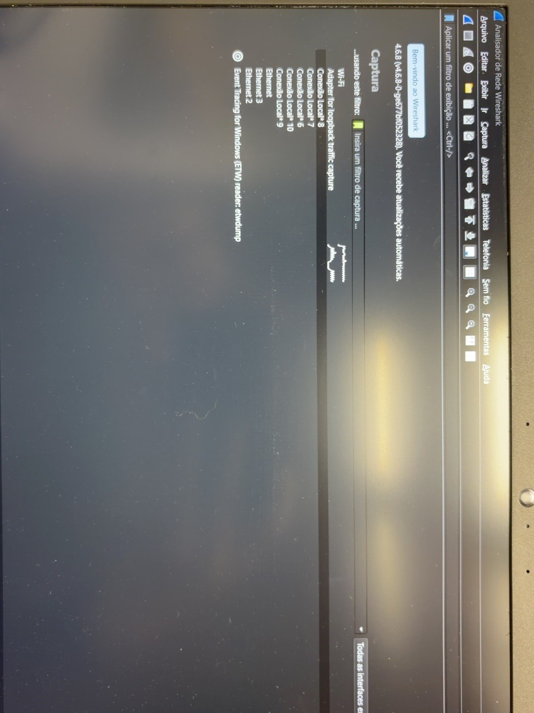

# 🦈 Análise de Tráfego de Rede com Wireshark

## 📌 Sobre o projeto

Este projeto apresenta uma atividade prática de análise de tráfego de rede utilizando o *Wireshark*.

Durante o laboratório, foi realizada uma captura de pacotes através da interface Wi-Fi e, posteriormente, foram utilizados filtros para localizar e analisar uma comunicação específica utilizando o protocolo HTTP.

A análise teve como foco compreender como uma comunicação de rede é estruturada e identificar informações relacionadas às camadas do modelo TCP/IP.

A atividade também permitiu relacionar conceitos estudados em *Redes de Computadores* com situações práticas de *Cibersegurança*.

---

# 🎯 1. Objetivos

Os principais objetivos da atividade foram:

- Realizar uma captura de tráfego de rede;
- Identificar os pacotes capturados;
- Utilizar filtros no Wireshark;
- Identificar protocolos de comunicação;
- Identificar endereços MAC;
- Identificar endereços IPv4;
- Identificar portas TCP;
- Analisar uma comunicação HTTP;
- Identificar uma requisição HTTP;
- Relacionar os protocolos às camadas do modelo TCP/IP;
- Desenvolver conhecimentos básicos de análise de tráfego de rede;
- Compreender a importância da análise de pacotes para a Cibersegurança.

---

# 🛠️ 2. Ferramentas utilizadas

### 🦈 Wireshark

Utilizado para realizar a captura e análise dos pacotes de rede.

### 🌐 Navegador

Utilizado para acessar o site durante a realização da captura.

### 🌐 NeverSSL

Utilizado como destino da comunicação HTTP analisada durante a atividade.

### 📡 Rede Wi-Fi

Interface de rede utilizada para realizar a captura dos pacotes.

---

# 📚 3. Conceitos envolvidos

Durante a atividade foram trabalhados conceitos relacionados a:

- Modelo TCP/IP;
- Ethernet;
- Endereço MAC;
- IPv4;
- TCP;
- Portas;
- HTTP;
- Requisições HTTP;
- Captura de pacotes;
- Análise de tráfego de rede.

---

# 🔬 4. Iniciando o Wireshark

O primeiro passo foi abrir o Wireshark e identificar as interfaces de rede disponíveis.

Foi selecionada a interface *Wi-Fi* para iniciar a captura do tráfego.

A partir desse momento, o Wireshark passou a registrar os pacotes que estavam sendo transmitidos e recebidos pela interface selecionada.

---

# 📡 5. Iniciando a captura

Após selecionar a interface Wi-Fi, a captura foi iniciada.

Durante esse processo, diversos pacotes foram registrados pelo Wireshark.

A captura permitiu observar diferentes protocolos e tipos de comunicação presentes no tráfego de rede.

---

# 🔢 6. Identificação do pacote 43343

Após aplicar o filtro HTTP, foi localizado o pacote de número *43343*.

Esse pacote foi selecionado para realizar uma análise mais detalhada da comunicação.

A comunicação identificada foi:

*192.168.0.44 → 34.223.124.45*

O protocolo identificado foi *HTTP*.

---

# 📋 7. Informações do pacote 43343

No pacote analisado foram identificadas as seguintes informações:

| Informação | Valor |
|---|---|
| Número do pacote | 43343 |
| IP de origem | 192.168.0.44 |
| IP de destino | 34.223.124.45 |
| Protocolo | HTTP |
| Porta de origem | 60674 |
| Porta de destino | 80 |
| Método HTTP | GET |
| Recurso solicitado | /online |
| Host | silverfunfreshlight.neverssl.com |

---

# 🧩 8. Análise do pacote por camadas

A partir do pacote 43343, foi possível analisar diferentes informações relacionadas às camadas do modelo TCP/IP.

A comunicação pode ser representada da seguinte forma:

*Aplicação → HTTP*

*Transporte → TCP*

*Internet → IPv4*

*Acesso à rede → Ethernet II*

---

# 🟩 9. Ethernet II

Na primeira parte da análise foi observado o protocolo *Ethernet II*.

Nessa camada são encontrados os endereços físicos das interfaces de rede, representados pelos endereços MAC.

### MAC de origem

*58:6d:67:2b:5f:57*

### MAC de destino

*1c:d1:1a:35:30:05*

Os endereços MAC são utilizados para identificar interfaces de rede dentro da comunicação Ethernet.

---

# 🟨 10. IPv4

Na camada Internet foi identificado o protocolo *IPv4*.

### IP de origem

*192.168.0.44*

### IP de destino

*34.223.124.45*

O endereço 192.168.0.44 representa o dispositivo de origem observado na rede local.

O endereço 34.223.124.45 representa o destino externo identificado na captura.

A comunicação pode ser representada como:

*192.168.0.44 → 34.223.124.45*

---

# 🟪 11. TCP

Na camada de Transporte foi identificado o protocolo *TCP*.

Foram observadas as seguintes portas:

### Porta de origem

*60674*

### Porta de destino

*80*

A comunicação pode ser representada da seguinte maneira:

*192.168.0.44:60674 → 34.223.124.45:80*

A porta 80 é tradicionalmente utilizada pelo protocolo HTTP.

O TCP fornece uma comunicação orientada à conexão entre os dispositivos.

---

# 🟦 12. HTTP

Na camada de Aplicação foi identificado o protocolo *HTTP*.

A requisição observada no pacote foi:

*GET /online HTTP/1.1*

O método HTTP utilizado foi *GET*.

O recurso solicitado foi:

*/online*

Também foi identificado o host:

*silverfunfreshlight.neverssl.com*

O método GET é utilizado para solicitar um recurso a um servidor.

---

# 🔗 13. Fluxo da comunicação

A comunicação analisada pode ser representada da seguinte forma:

*Dispositivo local*

*192.168.0.44*

↓

*TCP – Porta 60674*

↓

*34.223.124.45*

↓

*HTTP – Porta 80*

↓

*silverfunfreshlight.neverssl.com*

↓

*GET /online HTTP/1.1*

Essa análise permite visualizar como diferentes protocolos trabalham juntos durante uma comunicação de rede.

---

# 📊 14. Relação com o modelo TCP/IP

A análise do pacote permitiu relacionar as informações encontradas com as camadas do modelo TCP/IP.

| Camada | Protocolo | Informação observada |
|---|---|---|
| Aplicação | HTTP | GET /online HTTP/1.1 |
| Transporte | TCP | Porta 60674 → 80 |
| Internet | IPv4 | 192.168.0.44 → 34.223.124.45 |
| Acesso à rede | Ethernet II | Endereços MAC |

---

# 🔍 15. O que foi possível identificar

Através da análise do pacote 43343 foi possível identificar:

### 📌 Camada de Acesso à Rede

- Ethernet II;
- MAC de origem;
- MAC de destino.

### 📌 Camada Internet

- IPv4;
- IP de origem;
- IP de destino.

### 📌 Camada de Transporte

- TCP;
- Porta de origem;
- Porta de destino.

### 📌 Camada de Aplicação

- HTTP;
- Método GET;
- Recurso solicitado;
- Host.

---

# 🧠 16. Aprendizados

Durante a realização da atividade, foram desenvolvidos conhecimentos práticos sobre análise de tráfego de rede.

Entre os principais aprendizados estão:

- Utilização do Wireshark;
- Captura de pacotes;
- Aplicação de filtros;
- Identificação de protocolos;
- Análise de Ethernet;
- Identificação de endereços MAC;
- Análise de IPv4;
- Identificação de endereços IP;
- Análise do protocolo TCP;
- Identificação de portas;
- Análise do protocolo HTTP;
- Identificação de requisições HTTP;
- Relação entre protocolos e camadas do modelo TCP/IP.

---

# 🔐 17. Relação com Cibersegurança

A análise de tráfego de rede é um conhecimento importante para a área de *Cibersegurança*.

Ferramentas como o Wireshark podem auxiliar profissionais de segurança na compreensão do comportamento de uma rede e na investigação de eventos.

A análise de pacotes pode ajudar na identificação de:

- Comunicações inesperadas;
- Protocolos utilizados;
- Endereços envolvidos;
- Portas utilizadas;
- Requisições realizadas;
- Comportamentos suspeitos;
- Possíveis indícios de incidentes de segurança.

O conhecimento de redes é uma base importante para a atuação em Segurança da Informação.

---

# 🛡️ 18. Segurança das informações

Durante uma captura de rede podem aparecer informações que não devem ser publicadas.

Dependendo da comunicação analisada, uma captura pode apresentar:

- Cookies;
- Tokens;
- Identificadores de sessão;
- Credenciais;
- URLs;
- Endereços IP;
- Cabeçalhos HTTP;
- Dados enviados pelo navegador.

Por esse motivo, antes de publicar capturas no GitHub, informações sensíveis devem ser removidas ou ocultadas.

*Nenhuma credencial, cookie ou identificador de sessão deve ser compartilhado publicamente.*

---

# ⚠️ 19. Observação sobre o protocolo HTTP

O HTTP tradicionalmente utiliza a porta 80 e não oferece criptografia por si só.

Isso significa que informações transmitidas através de HTTP podem ficar mais expostas durante a comunicação.

Por esse motivo, atualmente é recomendado utilizar *HTTPS*, que adiciona criptografia através do TLS.

A atividade com o NeverSSL foi realizada para fins educacionais, permitindo observar o funcionamento do HTTP durante a captura.

---

# 📈 20. Resultado da atividade

A atividade foi concluída com sucesso.

Foi possível realizar uma captura de tráfego, aplicar um filtro HTTP e localizar o pacote 43343 para análise.

A partir desse pacote, foram identificadas informações de:

*Ethernet II → IPv4 → TCP → HTTP*

Também foi possível identificar os endereços MAC, endereços IP, portas TCP e a requisição HTTP realizada.

---

# 🎯 21. Conclusão

A realização deste laboratório permitiu transformar conceitos teóricos de Redes de Computadores em uma análise prática de tráfego.

Com o auxílio do Wireshark, foi possível observar como diferentes protocolos participam de uma comunicação e como suas informações são organizadas dentro de um pacote.

A análise do pacote *43343* possibilitou identificar:

- Ethernet II;
- IPv4;
- TCP;
- HTTP;
- Endereços MAC;
- Endereços IP;
- Portas TCP;
- Requisição HTTP.

Essa experiência contribuiu para o desenvolvimento de conhecimentos fundamentais para a área de *Cibersegurança*, especialmente em atividades relacionadas à análise de tráfego e investigação de comunicações de rede.

---

# 📚 22. Competências desenvolvidas

## 💻 Hard Skills

- Wireshark;
- Redes de Computadores;
- TCP/IP;
- Ethernet;
- IPv4;
- TCP;
- HTTP;
- Análise de pacotes;
- Análise de tráfego de rede;
- Identificação de protocolos;
- Identificação de portas.

## 🧠 Soft Skills

- Organização;
- Atenção aos detalhes;
- Raciocínio analítico;
- Resolução de problemas;
- Capacidade de investigação;
- Documentação técnica.

---

# 💡 23. O que eu faria em uma análise futura

Em uma análise mais aprofundada, seria possível utilizar outros filtros e recursos do Wireshark para investigar diferentes tipos de comunicação.

Alguns exemplos de análises futuras seriam:

- DNS;
- HTTPS;
- ICMP;
- TCP;
- UDP;
- ARP;
- Comunicação entre diferentes dispositivos;
- Identificação de padrões de tráfego;
- Investigação de possíveis comportamentos anômalos.

---

# 📌 24. Estrutura do projeto

A estrutura planejada para o repositório é:

*laboratorio-wireshark/*

├── README.md

└── imagens/

&nbsp;&nbsp;&nbsp;&nbsp;├── 01-interface-wifi.jpeg

&nbsp;&nbsp;&nbsp;&nbsp;├── 02-captura-wifi.jpeg

&nbsp;&nbsp;&nbsp;&nbsp;├── 03-neverssl.jpeg

&nbsp;&nbsp;&nbsp;&nbsp;├── 04-trafego-capturado.jpeg

&nbsp;&nbsp;&nbsp;&nbsp;├── 05-filtro-http.jpeg

&nbsp;&nbsp;&nbsp;&nbsp;├── 06-pacote-43343.jpeg

&nbsp;&nbsp;&nbsp;&nbsp;├── 07-ethernet.jpeg

&nbsp;&nbsp;&nbsp;&nbsp;├── 08-ipv4.jpeg

&nbsp;&nbsp;&nbsp;&nbsp;├── 09-tcp.jpeg

&nbsp;&nbsp;&nbsp;&nbsp;└── 10-http.jpeg

---

# 📁 25. Evidências

As imagens presentes neste repositório foram utilizadas como evidências da realização da atividade prática.

Elas demonstram:

1. Seleção da interface Wi-Fi;
2. Captura do tráfego;
3. Acesso ao NeverSSL;
4. Pacotes capturados;
5. Aplicação do filtro HTTP;
6. Localização do pacote 43343;
7. Análise Ethernet II;
8. Análise IPv4;
9. Análise TCP;
10. Análise HTTP.

As evidências foram organizadas na pasta *imagens* para facilitar a consulta durante a análise do projeto.

---

# 🎓 26. Contexto da atividade

Esta atividade foi desenvolvida como parte dos estudos relacionados a *Redes de Computadores e Cibersegurança*.

O laboratório teve como finalidade proporcionar uma experiência prática de captura e análise de tráfego de rede utilizando o Wireshark.

A atividade também contribuiu para a compreensão do funcionamento do modelo TCP/IP e da comunicação entre dispositivos em uma rede.

A experiência faz parte do meu processo de desenvolvimento profissional e da construção do meu portfólio na área de tecnologia e Cibersegurança.

---

## 👩‍💻 Autora

*Maria Clara Silveira*

🎓 Formada em Análise e Desenvolvimento de Sistemas  
💻 Analista de Suporte Técnico  
🔐 Em transição para a área de Cibersegurança

Este projeto faz parte do meu portfólio de estudos e desenvolvimento profissional em tecnologia e Cibersegurança.
